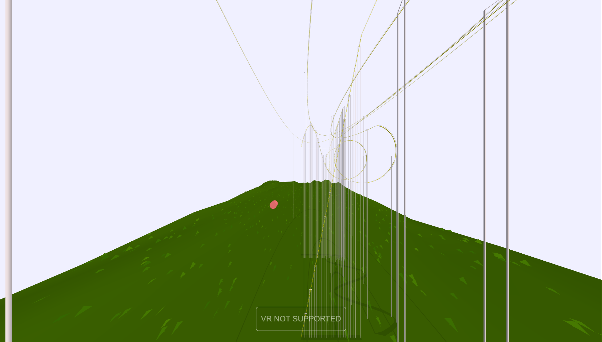
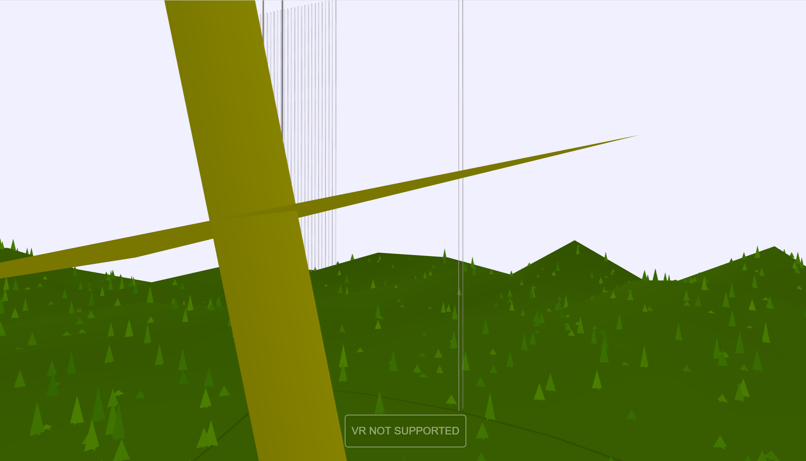
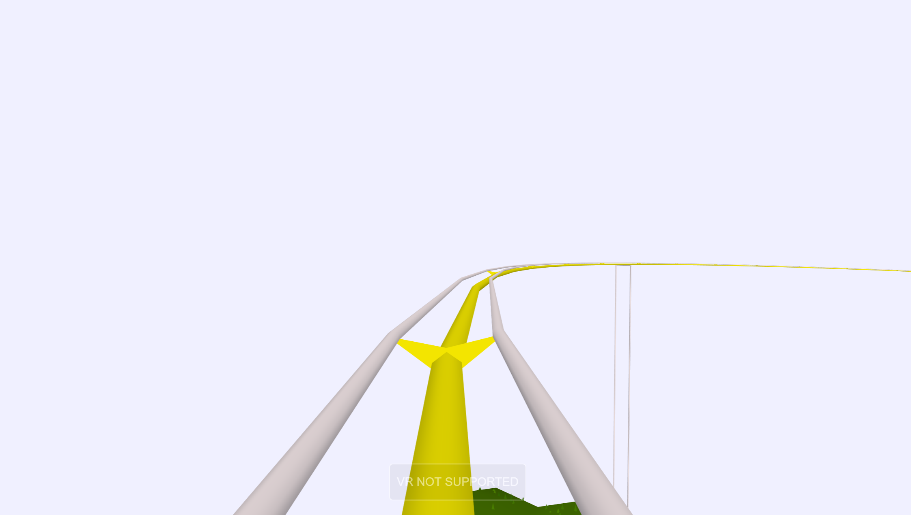
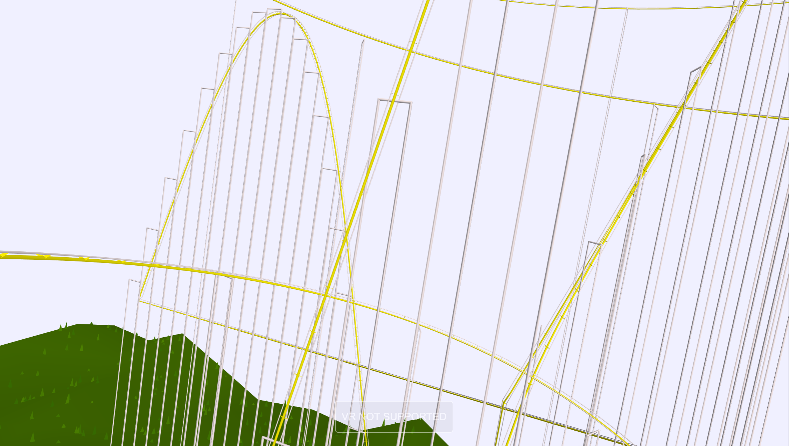
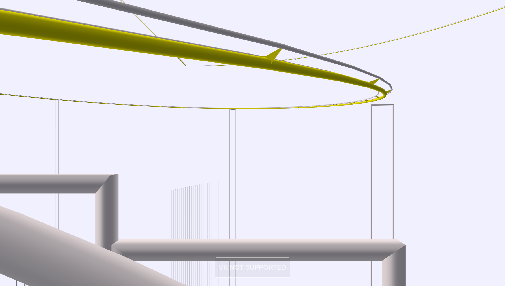

# roller-coaster

First-person view roller coaster based on the example from three.js.
Demo for my Advanced Topics Physics "Design a Roller Coaster" project.

Try it out here: https://alienkevin.github.io/roller-coaster/
Pull requests welcome!

# Controls

|   |   |
|---|---|
|Up arrow ⬆| increase cart speed|
|Down arrow ⬇| decrase cart speed|
|Left arrow ⬅| turn view left|
|Right arrow ➡| turn view right|
|Space| reset view to look forward|

# Events
1. Big slope up

2. Spiral down

3. Double loops

4. Three camelbacks

5. 180 turn

# License
MIT